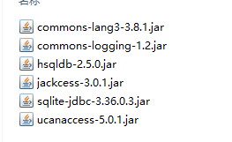

# 使用jackcess包创建Access数据仓库，并使用ucanaccess连接


需下载的包，使用ucanaccess下载能全包含，除了SQLite



```java

import java.sql.*;
import com.healthmarketscience.jackcess.*;
import java.io.*;

/* 
 * @Title:connAccess
 * @author: aaronmo
 *  
 * 
 */

public class App {
  public static void main(String args[]) throws SQLException {
    // CreateAccess();
    // connAccess();
    SELECTAccess();
  }

  public static void CreateAccess() throws SQLException {
    // Table newTable;Database db =
    try {
      DatabaseBuilder.create(Database.FileFormat.V2010, new File("./src/20220815.accdb"));
      // //建立数据表
      // newTable = new TableBuilder("NewTable")
      // .addColumn(new ColumnBuilder("a")
      // .setSQLType(Types.INTEGER))
      // .addColumn(new ColumnBuilder("b")
      // .setSQLType(Types.VARCHAR))
      // .toTable(db);
      // // 插入一条数据测试
      // newTable.addRow(1, "foo");

    } catch (IOException e) {
      // TODO Auto-generated catch block
      e.printStackTrace();
    }
  }

  // jackcess不支持sql查询，这里连接使用ucanaccess
  public static void connAccess() {
    {
      Connection c = null;
      Statement stmt = null;

      /*
       * org.sqlite.JDBC驱动SQLite
       * jdbc:sqlite:path
       * jdbc:ucanaccess://path
       */
      try {
        Class.forName("net.ucanaccess.jdbc.UcanaccessDriver");
        c = DriverManager.getConnection("jdbc:ucanaccess://./src/20220815.accdb");
        System.out.println("Opened database successfully");

        stmt = c.createStatement();
        //创建数据表
        // String sql = "CREATE TABLE COMPANY " +
        // "(ID INT PRIMARY KEY NOT NULL," +
        // " NAME TEXT NOT NULL, " +
        // " AGE INT NOT NULL, " +
        // " ADDRESS CHAR(50), " +
        // " SALARY REAL)";
        //插入数据
        String sql = "INSERT INTO COMPANY (ID,NAME,AGE,ADDRESS,SALARY) " +
            "VALUES (1, 'Paul', 32, 'California', 20000.00 );";
        stmt.executeUpdate(sql);
        c.commit();
        stmt.close();
        c.close();
      } catch (Exception e) {
        System.err.println(e.getClass().getName() + ": " + e.getMessage());
        System.exit(0);
      }
      System.out.println("INSERT successfully");
    }
  }
//SELECT 操作
  public static void SELECTAccess() {
    {
      Connection c = null;
      Statement stmt = null;

      /*
       * org.sqlite.JDBC驱动SQLite
       * jdbc:sqlite:path
       * jdbc:ucanaccess://path
       */
      try {
        Class.forName("net.ucanaccess.jdbc.UcanaccessDriver");
        c = DriverManager.getConnection("jdbc:ucanaccess://./src/20220815.accdb");
        c.setAutoCommit(false);
        System.out.println("Opened database successfully");

        stmt = c.createStatement();
        c.setAutoCommit(false);
        ResultSet rs = stmt.executeQuery("SELECT * FROM COMPANY;");
        while (rs.next()) {
          int id = rs.getInt("id");
          String name = rs.getString("name");
          int age = rs.getInt("age");
          String address = rs.getString("address");
          float salary = rs.getFloat("salary");
          System.out.println("ID = " + id);
          System.out.println("NAME = " + name);
          System.out.println("AGE = " + age);
          System.out.println("ADDRESS = " + address);
          System.out.println("SALARY = " + salary);
          System.out.println();
        }
        rs.close();
        stmt.close();
        c.close();
      } catch (Exception e) {
        System.err.println(e.getClass().getName() + ": " + e.getMessage());
        System.exit(0);
      }
      System.out.println("INSERT successfully");
    }
  }
}

```
