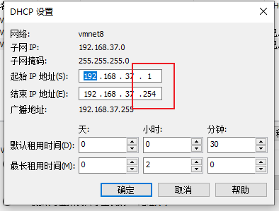

# VMware虚拟机搭建Linux环境

## 1.VMware虚拟机安装Linux系统


## 2.Centos7 静态地址配置





```
vi /etc/sysconfig/network-scripts/ifcfg-ens33
```


```
TYPE=Ethernet
PROXY_METHOD=none
BROWSER_ONLY=no

DEFROUTE=yes
IPV4_FAILURE_FATAL=no
IPV6INIT=yes
IPV6_AUTOCONF=yes
IPV6_DEFROUTE=yes
IPV6_FAILURE_FATAL=no
IPV6_ADDR_GEN_MODE=stable-privacy
NAME=ens33
UUID=c2010b70-dbd1-403a-b2ad-a827b9e7418e
DEVICE=ens33
ONBOOT=yes
BOOTPROTO=static//设为static表示使用静态IP
IPADDR=192.168.241.3//静态IP地址，要和上面子网IP一个网段内
GATEWAY=192.168.241.2//网关IP，配置成上面的网关IP
DNS1=8.8.8.8//DNS服务器，8.8.8.8即可
DNS2=114.114.114.114//DNS服务器


____________

systemctl restart network  #重启网络
```

## 三、VScode安装SSH插件连接虚拟机服务器


## 四、安装环境依赖


```
[root@localhost ~]# yum -y install zlib-devel bzip2-devel openssl-devel ncurses-devel sqlite-devel readline-devel tk-devel gcc make wget
```

### 五、为了DjangoWEB服务器的安装，要对python3进行升级(Linux中已经自带了Python2.7.5)shell脚本自动升级


1.1、查看Linux默认安装的Python位置

```
[root@localhost ~]# whereis python
python: /usr/bin/python /usr/bin/python2.7 /usr/lib/python2.7 /usr/lib64/python2.7 /etc/python /usr/include/python2.7 /usr/share/man/man1/python.1.gz
[root@localhost ~]# which python
/usr/bin/python          #指向路径
```
（1）登录https://www.python.org/downloads/source/，找到对应版本（我们以Python 3.10.5为例)
```
[root@localhost ~]# vi Python3_update.sh
写入：
wget https://www.python.org/ftp/python/3.10.5/Python-3.10.5.tgz
tar -zxvf Python-3.10.5.tgz
cd Python-3.10.5
./configure --prefix=/root/program/Python-3.10.5
make && make install
ln -s /root/program/Python-3.10.5/bin/python3.10 /usr/local/bin/python3
ln -s /root/program/Python-3.10.5/bin/pip3 /usr/local/bin/pip3
ls -l /usr/local/bin/
python3 --version
echo export PYTHON_HOME=/root/program/Python-3.10.5>> ~/.bash_profile
echo export PATH=$PYTHON_HOME/bin:$PATH>> ~/.bash_profile


[root@localhost ~]# chmod +x Python3_update.sh
[root@localhost ~]# sh Python3_update.sh
```

另,pip3安装插件包会失败 （pip3 install Django），可以通过以下代码解决，原理是Running pip as the 'root' user can result in broken permissions and conflicting behaviour with the system package manager.


```
pip3 install 包名 -i http://pypi.douban.com/simple --trusted-host pypi.douban.com
*******
1)http://mirrors.aliyun.com/pypi/simple/ 阿里云
2)https://pypi.mirrors.ustc.edu.cn/simple/ 中国科技大学
3) http://pypi.douban.com/simple/ 豆瓣
4) https://pypi.tuna.tsinghua.edu.cn/simple/ 清华大学
5) http://pypi.mirrors.ustc.edu.cn/simple/ 中国科学技术大学

设置方法：（以清华镜像为例，其它镜像同理）
（1）临时使用：
可以在使用pip的时候，加上参数-i和镜像地址(如
https://pypi.tuna.tsinghua.edu.cn/simple)，
例如：pip install -i https://pypi.tuna.tsinghua.edu.cn/simple pandas，这样就会从清华镜像安装pandas库。

（2）永久修改，一劳永逸：
（a）Linux下，修改 ~/.pip/pip.conf (没有就创建一个文件夹及文件。文件夹要加“.”，表示是隐藏文件夹)
内容如下：

[global]
index-url = https://pypi.tuna.tsinghua.edu.cn/simple
[install]
trusted-host = https://pypi.tuna.tsinghua.edu.cn

(b) windows下，直接在user目录中创建一个pip目录，如：C:\Users\xx\pip，然后新建文件pip.ini，即 %HOMEPATH%\pip\pip.ini，在pip.ini文件中输入以下内容（以豆瓣镜像为例）：

[global]
index-url = http://pypi.douban.com/simple
[install]
trusted-host = pypi.douban.com

```


### 建设虚拟环境管理工具venv

创建虚拟环境
要创建虚拟环境，请确定要放置它的目录，并将 venv模块作为脚本运行目录路径:
```cmd
[root@localhost ~]# python3 -m venv tutorial-env
```
这将创建tutorial-env目录，如果它不存在的话，并在其中创建包含 Python 解释器副本和各种支持文件的目录。
激活虚拟环境
创建虚拟环境后，您可以激活它。

在Windows上，cmd里运行:
```cmd
[root@localhost ~]# tutorial-env\Scripts\activate.bat
```
在Unix或MacOS上，运行:
```cmd
(tutorial-env)[root@localhost ~]# source tutorial-env/bin/activate
```
（这个脚本是为bash shell编写的。如果你使用csh或 fish shell，你应该改用 activate.csh或 activate.fish

脚本。）

注意：激活虚拟环境后，提示符前面会出现括号，里面是虚拟环境名称。

退出虚拟环境
在 shell 中输入
```cmd
[root@localhost ~]# deactivate
```
### 2、但启动Django又出现了其它问题，如django-admin无法创建、SQLite升级（因为linux系统版本低，如安装Django需要升级到最新版）shell脚本自动升级


用pip3安装Django

### 3、django.core.exceptions.ImproperlyConfigured: SQLite 3.9.0 or later is required (found 3.7.17)

```
[root@localhost ~]# vi SQLite_update.sh

wget  https://www.sqlite.org/2022/sqlite-autoconf-3390200.tar.gz
tar -xaf sqlite-autoconf-3390200.tar.gz
cd sqlite-autoconf-3390200
./configure --prefix=/usr/local/
make && make install
mv  /usr/bin/sqlite3 /usr/bin/sqlite3.bak
ln -s /usr/local/bin/sqlite3 /usr/bin/sqlite3
echo export LD_LIBRARY_PATH="/usr/local/lib">> ~/.bashrc
source ~/.bashrc
sqlite3 --version

[root@localhost ~]# chmod +x SQLite_update.sh
[root@localhost ~]# sh SQLite_update.sh


```

使用第三方包运行SQLite。把sqlite3 更换为pysqlite3 和 pysqlite3-binary方法(网络上有好几种方式，但这个方式百试百灵)

1、安装pysqlite3和pysqlite3-binary(一定要先更新pip & setuptools为最新版本/usr/local/bin/python3 -m pip install --upgrade setuptools -i http://pypi.douban.com/simple --trusted-host pypi.douban.com)

pip3 install pysqlite3 
pip3 install pysqlite3-binary

2、打开文件/usr/local/python3/lib/python3.8/site-packages/django/db/backends/sqlite3/base.py，找到 
```
from sqlite3 import dbapi2 as Database 注释它，添加代码

from pysqlite3 import dbapi2 as Database #新加这段代码

```
